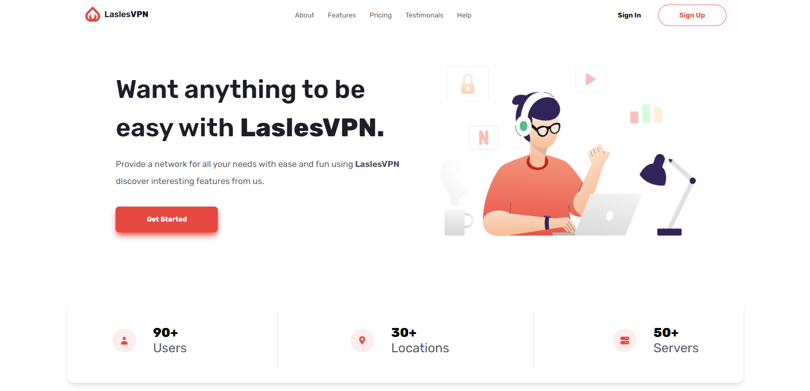
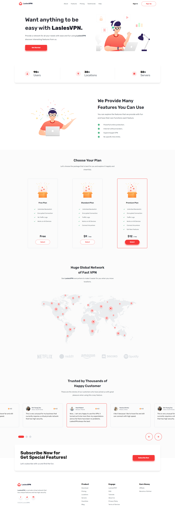

# LaslesVPN Landing Page 



This application allows users to explore a static VPN website. It has been developed using technologies such as Vue.js, Tailwind CSS, and Glide.js.

[Figma Link Here](https://www.figma.com/community/file/858999227165747995/freebies-landingpage-laslesvpn?searchSessionId=lsh8v38f-3va7guzfvxh)

## How to Run?

1. Download or clone the application:

    ```
    git clone https://github.com/Rekl0w/LaslesVPN.git
    ```

2. Navigate to the project directory:

    ```
    cd LaslesVPN
    ```

3. Install dependencies:

    ```
    npm install
    ```

4. Run the app.

    ```
    npm run dev
    ```

5. The LaslesVPN application will start.

## Technologies Used

- React
- Javascript
- Tailwind
- Vite
- Glide.js

## Screenshots



## License

This project is licensed under the MIT License. See the [LICENSE](LICENSE) file for more information.
